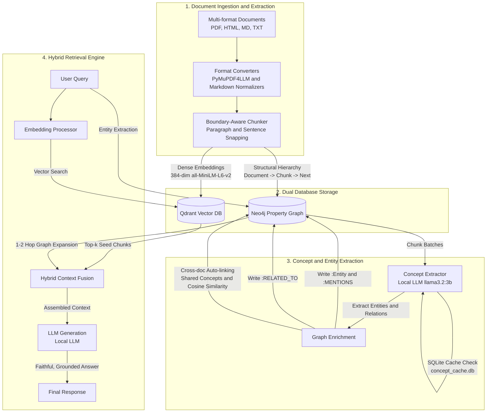

# GraphRAG: Hybrid Knowledge Graph and Vector Retrieval Engine

A dual-engine Hybrid GraphRAG (Retrieval-Augmented Generation) system built for complex, interconnected documentation. 

By unifying dense vector search (Qdrant) with symbolic property graph traversal (Neo4j), GraphRAG bridges the gap between semantic similarity and multi-hop relational reasoning across arbitrary domains.

---

## What Problem Does This Solve?


### The Limitations of Traditional Vector-Only RAG

Standard RAG pipelines convert documents into unstructured chunks, embed them into high-dimensional vector spaces, and retrieve the nearest neighbors via cosine similarity. In interconnected technical systems, this approach breaks down:

1. **Failure on Multi-Hop Causal Chains**:
   - Vector search returns chunks that share lexical or semantic proximity to query terms, but cannot traverse sequential or causal dependencies across topics where intermediate concepts are not explicitly stated in the query.
2. **Context Fragmentation and Lost Hierarchy**:
   - Fixed-character or token-based chunking frequently divides sentences mid-phrase and detaches tables from their associated section headers, corrupting structured specifications.
3. **Absence of Global Relational Structure**:
   - Vector databases treat every chunk as an independent point in vector space, discarding parent document context, sequential flow, and shared conceptual entities.

### Illustrative Example: Vector DB vs. GraphRAG

Consider a simple knowledge base spread across three short notes:
- **Document 1**: "Alice leads Project Phoenix."
- **Document 2**: "Project Phoenix runs entirely on Server X."
- **Document 3**: "Server X will be shut down tonight for maintenance."

**Question**: *"Whose project will be disrupted by tonight's maintenance?"*

- **Where a Vector DB Fails**:
  - The vector search embeds the question and looks for chunks mentioning *"maintenance"*, *"shut down"*, or *"disrupted"*.
  - It easily retrieves Document 3 (*"Server X maintenance"*) and perhaps Document 2 (*"Server X"*).
  - However, Document 1 only says *"Alice leads Project Phoenix"*. It has zero semantic or keyword overlap with *"maintenance"*, *"shut down"*, or *"server"*.
  - Because Document 1 receives a low similarity score, it never enters the LLM prompt.
  - **Result**: The model can say Project Phoenix uses Server X, but cannot answer *whose* project is affected (Alice), or it hallucinates a guess.

- **How GraphRAG Solves It**:
  - **Step 1 (Vector Recall)**: Semantic search matches the query to Document 3 (*Server X*).
  - **Step 2 (Graph Traversal)**: The engine walks the relationships in the graph:
    `(:Server {name: "Server X"}) <-[:RUNS_ON]- (:Project {name: "Project Phoenix"}) <-[:LEADS]- (:Person {name: "Alice"})`
  - **Step 3 (Context Fusion)**: GraphRAG pulls all three connected documents into the LLM context.
  - **Result**: The model directly and accurately answers: *"Alice's Project Phoenix will be disrupted because it runs on Server X."*

### The Hybrid GraphRAG Solution

GraphRAG combines the complementary strengths of both paradigms:

```
+------------------------------------------------------------------------+
|                        USER QUERY / INTENT                             |
+-------------------+--------------------------------+-------------------+
                    |                                |
                    v                                v
       [ Vector Similarity Search ]     [ Graph Symbolic Traversal ]
       - Fast semantic entrypoints      - Multi-hop entity exploration
       - Top-k chunk recall (Qdrant)    - Dependency paths (Neo4j)
                    |                                |
                    +---------------+----------------+
                                    |
                                    v
                     [ Hybrid Context Assembly ]
                     - Merges seed chunks with 1-2 hop neighbors
                     - Eliminates duplicates and preserves hierarchy
                                    |
                                    v
                       [ Grounded LLM Response ]
```

- **Vector Recall (Qdrant)** identifies the primary entry points based on semantic similarity.
- **Graph Traversal (Neo4j)** walks the entity graph (`:MENTIONS`, `:RELATED_TO`, `:NEXT`, `:HAS_CHUNK`) to gather systemic dependencies across separate documents.
- **Boundary-Aware Ingestion** ensures tables, headers, and sentences remain whole and contextually anchored.

---

## Architecture and Pipeline Flow



---

## System Metrics and Graph Topology

Current metrics across the processed knowledge base:

| Component | Metric | Description |
| :--- | :---: | :--- |
| **Documents** | **12** | Ingested source manuals across Markdown, PDF, HTML, and text |
| **Clean Chunks** | **85** | Structure- and boundary-aware chunks |
| **Vector Points** | **85** | 384-dimensional dense vectors stored in Qdrant collection `document_chunks` |
| **Unique Entities** | **192** | Domain concepts, components, states, and operational parameters |
| **Chunk Mentions (`:MENTIONS`)** | **283** | Graph edges connecting document chunks to the entities discussed within them |
| **Entity Relations (`:RELATED_TO`)** | **218** | Direct inter-concept relationships across topics |
| **Document Relations (`:RELATED_TO`)** | **16** | Cross-document links inferred from shared entity overlap and embedding similarity |
| **Total Relationships** | **659** | Complete knowledge graph network in Neo4j |

---

## Repository Structure

```
GraphRAG/
|-- data/
|   |-- input/                     # Raw input documents
|   |-- neo4j/                     # Persistent Neo4j database files
|   `-- qdrant/                    # Persistent Qdrant vector storage
|-- docs/
|   |-- decisions.md               # Architecture decision records (ADRs)
|   |-- flow.md                    # Detailed pipeline flow documentation
|   |-- graphrag-hybrid-plan.md    # System extension and specification plan
|   `-- visualization_guide.md     # Cypher queries and visualization instructions
|-- scripts/
|   |-- import_docs.py             # Ingestion, boundary chunking, vectors, and base graph
|   |-- extract_concepts.py        # Entity extraction and cross-document relationship inference
|   |-- generate_visualizations.py # Computes t-SNE / PCA and exports graph topology
|   |-- query_demo.py              # Interactive CLI for hybrid retrieval
|   |-- test_hallucination.py      # Verification benchmark against edge cases
|   `-- test_pipeline.py           # End-to-end integration test runner
|-- src/
|   |-- config.py                  # Environment and configuration management
|   |-- query_engine.py            # Hybrid retrieval logic (Vector recall + Graph expansion)
|   |-- database/
|   |   |-- neo4j_manager.py       # Neo4j Cypher executor and graph schema manager
|   |   `-- qdrant_manager.py      # Qdrant client, payload indexing, and vector search
|   |-- processors/
|   |   |-- concept_extractor.py   # LLM client with SQLite caching and repetition control
|   |   |-- document_processor.py  # Boundary-aware text and markdown chunker
|   |   |-- embedding_processor.py # Embedding pipeline (all-MiniLM-L6-v2)
|   |   `-- format_converter.py    # PyMuPDF4LLM PDF, HTML, and text normalizers
|   `-- utils/
|       |-- neo4j_utils.py         # Advanced Cypher graph algorithms and auto-linking
|       `-- qdrant_utils.py        # Vector similarity utilities
|-- visualizations/                # Generated vector and graph topology assets
|   |-- entity-bridges.svg         # Cross-document entity bridge diagram
|   |-- inter-entity.svg           # Inter-concept relationship network
|   `-- knowledge-graph.svg        # Complete knowledge graph topology
|-- your_docs_here/                # Document corpus directory
|-- docker-compose.yml             # Container orchestration for Neo4j (5.18) and Qdrant (v1.8.0)
|-- requirements.txt               # Pinned Python package dependencies
`-- README.md                      # Project documentation
```

---

## Quickstart: Clone and Execute

### 1. Prerequisites

- Docker Desktop installed and running.
- Python 3.10+ installed.
- Ollama installed with `llama3.2:3b` pulled:
  ```bash
  ollama pull llama3.2:3b
  ollama serve
  ```

### 2. Clone and Setup Environment

```bash
git clone https://github.com/vignesh-poovanna/GraphRAG.git
cd GraphRAG

# Create and activate virtual environment
python -m venv venv
# On Windows:
.\venv\Scripts\activate
# On Linux/macOS:
source venv/bin/activate

# Install dependencies
pip install -r requirements.txt
```

### 3. Launch Database Containers

Start Neo4j and Qdrant in detached mode:

```bash
docker-compose up -d
```

Database endpoints:
- Neo4j Browser: http://localhost:7474 (`neo4j` / `password`)
- Qdrant Dashboard: http://localhost:6333/dashboard

### 4. Ingest Documents and Build Vector/Base Graph

Parse all files in `your_docs_here/`, perform boundary-aware chunking, generate embeddings, and populate both databases:

```bash
python scripts/import_docs.py
```

### 5. Extract Concepts and Build Knowledge Graph

Extract technical entities and infer cross-document relationships using the local LLM:

```bash
python scripts/extract_concepts.py --batch-size 3
```

*(Unchanged chunks are cached in `concept_cache.db`; subsequent runs complete in seconds).*

### 6. Run Hybrid Queries

Execute hybrid queries combining vector similarity with graph traversal:

```bash
python scripts/query_demo.py
```

To get a grounded LLM answer (will refuse to answer if the context does not contain it):

```bash
python scripts/query_demo.py --query "your question here" --answer
```

#### Programmatic Usage

Save either snippet below as a `.py` file in the project root, then run it with:

```bash
# Windows
.\venv\Scripts\python.exe my_query.py

# Linux / macOS
./venv/bin/python my_query.py
```

**Retrieval only** — returns ranked source chunks with scores, no LLM involved:

```python
# my_query.py
from src.config import Config
from src.database.neo4j_manager import Neo4jManager
from src.database.qdrant_manager import QdrantManager
from src.processors.embedding_processor import EmbeddingProcessor
from src.query_engine import QueryEngine

cfg = Config()
emb = EmbeddingProcessor(cfg); emb.load_model()
neo = Neo4jManager(cfg); neo.connect()
qd  = QdrantManager(cfg, emb); qd.connect()
engine = QueryEngine(neo, qd, emb)

results = engine.hybrid_search("how do the subsystems interact under fault conditions", limit=3)
for r in results:
    print(r["text"][:300])
    print("---")

neo.close(); qd.close(); emb.unload_model()
```

**Grounded LLM answer** — retrieves context, then generates a strictly context-bound response.
If the knowledge base does not contain the answer, the system returns exactly:
`"The documentation does not contain information regarding this question."`

```python
# my_query.py
from src.config import Config
from src.database.neo4j_manager import Neo4jManager
from src.database.qdrant_manager import QdrantManager
from src.processors.embedding_processor import EmbeddingProcessor
from src.query_engine import QueryEngine

cfg = Config()
emb = EmbeddingProcessor(cfg); emb.load_model()
neo = Neo4jManager(cfg); neo.connect()
qd  = QdrantManager(cfg, emb); qd.connect()
engine = QueryEngine(neo, qd, emb)

result = engine.generate_answer("how do the subsystems interact under fault conditions")
print(result["answer"])

neo.close(); qd.close(); emb.unload_model()
```

> **Important**: Do not call `ollama.generate()` or `ollama.chat()` directly.
> `generate_answer()` enforces a system-level guardrail that prevents the LLM from using its
> training knowledge. A manually crafted prompt will not reliably enforce this constraint,
> especially with smaller models.


---

## Visualizing the Knowledge Graph

### Static Visualizations

The `visualizations/` directory contains pre-rendered SVG architecture maps of the live system:

| Diagram | Description |
| :--- | :--- |
| **[`visualizations/knowledge-graph.svg`](visualizations/knowledge-graph.svg)** | Complete overview of all Documents, Chunks, and Entities. |
| **[`visualizations/entity-bridges.svg`](visualizations/entity-bridges.svg)** | Demonstrates how shared concepts bridge distinct documents. |
| **[`visualizations/inter-entity.svg`](visualizations/inter-entity.svg)** | Conceptual relationship network between extracted entities. |

### Visualizing Live in Neo4j Browser

1. Navigate to http://localhost:7474.
2. Connect using:
   - **Connect URL**: `neo4j://localhost:7687` (or `bolt://localhost:7687`)
   - **Username**: `neo4j`
   - **Password**: `password`
3. Execute any of the following Cypher queries in the editor bar:

#### A. Cross-Document Entity Bridges
Shows how specific technical entities connect chunks from different source documents:
```cypher
MATCH (d1:Document)-[:HAS_CHUNK]->(c1:Chunk)-[:MENTIONS]->(e:Entity)<-[:MENTIONS]-(c2:Chunk)<-[:HAS_CHUNK]-(d2:Document)
WHERE d1 <> d2
RETURN d1.title, c1, e, c2, d2.title LIMIT 60;
```

#### B. Inter-Entity Relationship Graph
Explores direct relationships between extracted entities and concepts:
```cypher
MATCH (e1:Entity)-[r:RELATED_TO]->(e2:Entity)
RETURN e1, r, e2 LIMIT 120;
```

#### C. Document Hierarchy and Chunks
Visualizes how source documents decompose into sequentially ordered chunks:
```cypher
MATCH (d:Document)-[:HAS_CHUNK]->(c:Chunk)
OPTIONAL MATCH (c)-[n:NEXT]->(c2:Chunk)
RETURN d, c, n, c2 LIMIT 100;
```

---

## Roadmap and Future Work

- **User-Friendly Interface with Dual-Channel Interaction**:
  - Deploy a clean, accessible user interface for transparent human-to-agent exploration and real-time graph visualization.
  - Decouple and specialize communication layers into two distinct operational modalities:
    - **RAG Agent-to-Human Conversation**: Explains technical deductions in clear natural language, displays step-by-step reasoning paths, provides clickable document provenance citations, and handles follow-up inquiries.
    - **RAG Agent-to-Agent Conversation**: Exposes a structured programmatic protocol (via Model Context Protocol / JSON-RPC) allowing upstream reasoning or coordinator agents to query GraphRAG autonomously, request targeted sub-graph neighborhood expansions, and ingest machine-verifiable context with confidence scores.
- **Voice Interaction with Smart Interruption**:
  - Add a bidirectional streaming voice layer (Whisper STT with low-latency TTS).
  - Implement smart interruption (barge-in detection) allowing operators to interrupt mid-generation to refine constraints or pivot inquiry paths without resetting session context.
- **Knowledge Base Expansion**:
  - Dynamic telemetry and log ingestion: stream real-time operational logs into graph nodes to support predictive diagnostic queries.
  - Multi-modal schematic understanding: parse technical diagrams, tables, and wiring schematics into structured graph entities.
- **Adaptive Graph Search**:
  - Incorporate personalized PageRank and community detection (Leiden/Louvain) for automated global summarization over arbitrary subgraphs.

---

## Tech Stack

| Layer | Technology | Role |
| :--- | :--- | :--- |
| **Graph Database** | Neo4j 5.18 | Property graph storage, Cypher query execution, multi-hop relationship traversal |
| **Vector Database** | Qdrant v1.8.0 | High-dimensional dense vector indexing (HNSW), semantic cosine search, payload filtering |
| **Embedding Model** | all-MiniLM-L6-v2 (384-d) | Sentence-level dense vector representations via FastEmbed / Sentence-Transformers |
| **Language Model** | Ollama (llama3.2:3b) | Local entity and relationship extraction, query synthesis, contextual response generation |
| **Document Processing** | PyMuPDF4LLM, BeautifulSoup4 | Structured extraction of Markdown tables, headings, and text across PDF, HTML, and text |
| **Dimensionality Reduction** | Scikit-learn, NumPy | 2D t-SNE and 3D PCA projection algorithms for embedding space analysis |
| **Orchestration** | Docker, Docker Compose | Containerized local deployment for Neo4j and Qdrant database clusters |
| **Caching Layer** | SQLite (concept_cache.db) | Content-hash caching for idempotent, zero-redundancy concept extraction |
| **Integration Layer** | Model Context Protocol (MCP) | Standardized tool interface adapter for external agent integration |

---

## License

This project is licensed under the MIT License - see the [LICENSE](LICENSE) file for details.